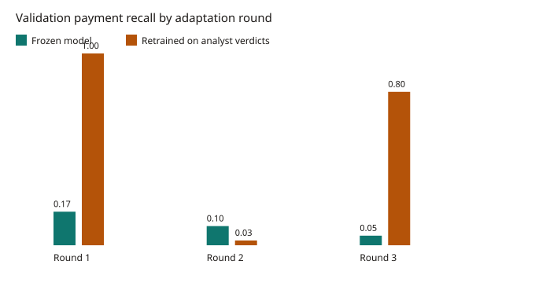

# Adaptive adversary (validation)

Profile `fast`, seed 42. Three cumulative changes to misuse QR payments only, then the frozen LightGBM and a model retrained on simulated analyst verdicts. Verdicts use the configured case noise (misuse cleared 0.15, honest convicted 0.05). The model is given the noisy verdict, not the hidden label. Only train shops are reviewed, capped at the analyst shop capacity, so validation rows are not training rows. Spreading keeps a payment inside the same shop split, so it does not leak into test.

| Round | Change | Moved | Reviewed | Frozen recall | Retrained recall | Frozen FPR | Retrained FPR | N | Positives |
|---|---|---|---|---|---|---|---|---|---|
| 0 | No adaptation | 0 | 0 | 0.475 | 0.475 | 0.000 | 0.000 | 1,416 | 40 |
| 1 | Drop round amounts | 0 | 20 | 0.175 | 1.000 | 0.000 | 0.073 | 1,416 | 40 |
| 2 | Drop round amounts, and move about half the misuse payments to other shops | 766 | 43 | 0.100 | 0.025 | 0.000 | 0.000 | 1,416 | 40 |
| 3 | Also cut misuse amounts in half | 769 | 30 | 0.050 | 0.800 | 0.000 | 0.195 | 1,416 | 40 |

Shop-level recall uses the maximum payment score. A shop is misuse if any of its validation payments is.

| Round | Frozen shop recall | Retrained shop recall | Shops | Misuse shops |
|---|---|---|---|---|
| 0 | 1.000 | 1.000 | 53 | 4 |
| 1 | 0.500 | 1.000 | 53 | 4 |
| 2 | 0.286 | 0.071 | 53 | 14 |
| 3 | 0.118 | 1.000 | 53 | 17 |

Round 0 retrained equals frozen, because there is no new analyst verdict yet. Later rounds retrain after the frozen model flags train shops on that adapted world. A higher retrained recall is not a free repair: the FPR column is the honest payments flagged after that retrain. This is one seed.

Round 1: retrained recall 1.000 against frozen 0.175, with retrained false-positive rate 0.073. Round 2: retrained recall 0.025 does not beat frozen 0.100. Round 3: retrained recall 0.800 against frozen 0.050, with retrained false-positive rate 0.195.
