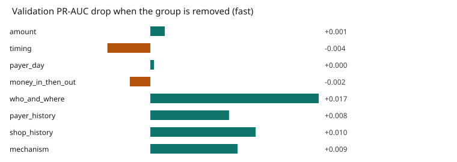

# Feature justification (validation)

Generated by `python -m jachai.eval.feature_justification` with profile `fast`. Synthetic data only. LightGBM, same shop-and-time split as the payment model, seeds 42, 7, 2026. Metrics are mean ± sample standard deviation across seeds. Validation payments: seed 42: N=1,416, positives=40; seed 7: N=1,891, positives=6; seed 2026: N=2,161, positives=31. Mean N=1823, mean positives=26. A drop is full-model score minus the score without that group: positive means the group was helping. SHAP is the mean absolute TreeSHAP contribution on the raw score (LightGBM `pred_contrib`), summed inside the group. Permutation shuffles the group's columns together, 5 times, and records the drop in validation PR-AUC. Thresholds for F1 and recall are fit on validation targets, not on the hidden label. The test split is not scored. Compute time: 13.4s. This file does not replace reports/onsite/ai/model_comparison.md.

## Importance and ablation

| Group | Features | SHAP mean abs | SHAP share | Permutation PR-AUC drop | PR-AUC drop | F1 drop | Recall drop |
| --- | --- | --- | --- | --- | --- | --- | --- |
| amount | 8 | 0.797 ± 0.091 | 0.576 ± 0.028 | 0.318 ± 0.276 | 0.001 ± 0.127 | 0.034 ± 0.051 | 0.081 ± 0.100 |
| timing | 3 | 0.020 ± 0.011 | 0.013 ± 0.007 | 0.009 ± 0.016 | -0.004 ± 0.022 | -0.002 ± 0.014 | 0.000 ± 0.000 |
| payer_day | 4 | 0.187 ± 0.059 | 0.132 ± 0.023 | 0.131 ± 0.071 | 0.000 ± 0.146 | -0.006 ± 0.181 | 0.035 ± 0.333 |
| money_in_then_out | 6 | 0.010 ± 0.007 | 0.007 ± 0.004 | 0.002 ± 0.002 | -0.002 ± 0.017 | -0.017 ± 0.056 | -0.083 ± 0.144 |
| who_and_where | 4 | 0.151 ± 0.059 | 0.106 ± 0.027 | 0.019 ± 0.067 | 0.017 ± 0.055 | 0.043 ± 0.076 | -0.018 ± 0.166 |
| payer_history | 6 | 0.014 ± 0.002 | 0.010 ± 0.002 | 0.019 ± 0.035 | 0.008 ± 0.016 | 0.005 ± 0.019 | 0.022 ± 0.037 |
| shop_history | 12 | 0.150 ± 0.017 | 0.111 ± 0.029 | 0.065 ± 0.036 | 0.010 ± 0.014 | -0.046 ± 0.044 | -0.092 ± 0.159 |
| mechanism | 4 | 0.062 ± 0.011 | 0.044 ± 0.004 | 0.011 ± 0.011 | 0.009 ± 0.020 | -0.031 ± 0.079 | -0.100 ± 0.173 |

## Mechanism features, dropped one at a time

These four columns are also inside the `mechanism` group above. The single-column rows show whether one of them, rather than the bundle, moves the score.

| Feature | SHAP mean abs | PR-AUC drop | F1 drop | Recall drop |
| --- | --- | --- | --- | --- |
| payer_repeat_rate | 0.020 ± 0.017 | -0.002 ± 0.004 | -0.007 ± 0.013 | 0.000 ± 0.000 |
| one_time_payer_share_30d | 0.018 ± 0.012 | -0.001 ± 0.001 | 0.001 ± 0.020 | 0.043 ± 0.074 |
| hour_vs_shop_median_30d | 0.009 ± 0.006 | -0.003 ± 0.002 | 0.011 ± 0.022 | 0.011 ± 0.019 |
| minutes_since_inflow | 0.015 ± 0.003 | -0.000 ± 0.006 | -0.011 ± 0.012 | 0.000 ± 0.000 |

## What each group is for, and what the run showed

| Feature group | Real-world mechanism it captures | Evidence |
| --- | --- | --- |
| amount | Round amounts, a basket far from the category's usual ticket, and payments just under the incentive cap. Hypothesis: a cash desk and cap-splitting leave these traces. | SHAP share 0.576 ± 0.028; permutation PR-AUC drop 0.318 ± 0.276; retrain PR-AUC drop 0.001 ± 0.127 (N≈1823, positives≈26). |
| timing | Hour, Friday, and whether the payment is outside opening hours. Hypothesis: cash-out desks run when the shop would normally be shut. | SHAP share 0.013 ± 0.007; permutation PR-AUC drop 0.009 ± 0.016; retrain PR-AUC drop -0.004 ± 0.022 (N≈1823, positives≈26). |
| payer_day | How much this payer has already paid today, and how that compares with the daily limit. Hypothesis: limit bypass is a day total pushed across several shops. | SHAP share 0.132 ± 0.023; permutation PR-AUC drop 0.131 ± 0.071; retrain PR-AUC drop 0.000 ± 0.146 (N≈1823, positives≈26). |
| money_in_then_out | Add-money or remittance in a short window before the payment, and the share spent. Hypothesis: a drain pays out money that has just arrived. | SHAP share 0.007 ± 0.004; permutation PR-AUC drop 0.002 ± 0.002; retrain PR-AUC drop -0.002 ± 0.017 (N≈1823, positives≈26). |
| who_and_where | First visit at this shop, and how far the payer lives from it. Hypothesis: a cash desk is paid by people who are not its regulars and do not live nearby. | SHAP share 0.106 ± 0.027; permutation PR-AUC drop 0.019 ± 0.067; retrain PR-AUC drop 0.017 ± 0.055 (N≈1823, positives≈26). |
| payer_history | The payer's recent volume, shops, round-amount share and account age. Hypothesis: a mule account is young and busy. | SHAP share 0.010 ± 0.002; permutation PR-AUC drop 0.019 ± 0.035; retrain PR-AUC drop 0.008 ± 0.016 (N≈1823, positives≈26). |
| shop_history | The shop's recent turnover, round receipts, night share, strangers and peer comparison. Hypothesis: a misused shop looks unlike its own past and unlike similar shops. | SHAP share 0.111 ± 0.029; permutation PR-AUC drop 0.065 ± 0.036; retrain PR-AUC drop 0.010 ± 0.014 (N≈1823, positives≈26). |
| mechanism | Payer repeat rate, one-time-payer share, time of day versus this shop's own hours, and minutes from the last top-up or remittance. Hypothesis: the same stories at a finer grain. | SHAP share 0.044 ± 0.004; permutation PR-AUC drop 0.011 ± 0.011; retrain PR-AUC drop 0.009 ± 0.020 (N≈1823, positives≈26). |

## Chart



## Caveats

- Fast-profile validation has few misuse payments, so a drop inside the seed-to-seed spread is not a stable ranking.
- SHAP is on the raw score. Permutation and ablation are on calibrated probabilities graded with the hidden label.
- Retraining without a group also refits the threshold, so an F1 drop is not a pure feature effect.
- The mechanism stories are hypotheses. A small or negative drop means this run did not show that the group helps.
- The model-comparison report was fit before these four columns existed. Its numbers are unchanged.

## Reproduce

```bash
JACHAI_PROFILE=fast python -m jachai.eval.feature_justification
```
