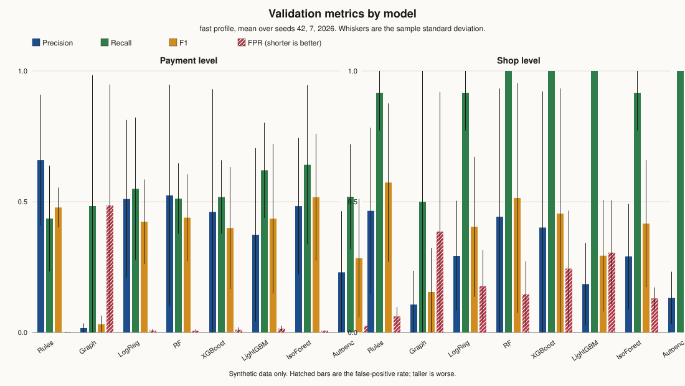

# Model comparison (validation)

Generated by `python -m jachai.eval.model_comparison` with profile `fast`. Synthetic data only. Every metric is on the validation shop-and-time split, against the hidden true label, as mean ± sample standard deviation (n−1) over seeds 42, 7, 2026. Counts (N, positives) sit in the same cell as every metric. Validation size: seed 42: 1,416 payments (40 misuse), 53 shops (4 misuse); seed 7: 1,891 payments (6 misuse), 58 shops (1 misuse); seed 2026: 2,161 payments (31 misuse), 57 shops (4 misuse). Configured analyst capacity is 1000 payments and 50 shops; precision@k uses min(capacity, N). The test split is not scored (test_set_touched=false). Compute time: 9.9s.

## Model we keep

We keep LightGBM. Random forest leads mean supervised payment PR-AUC by 0.310, inside the combined seed-to-seed std (0.506). It is ahead of LightGBM on that metric in 3 of 3 seeds. The pre-set bar for swapping the frozen payment model is a mean gap larger than that combined std, so we keep LightGBM. The direction of the lead is consistent across seeds; what the std leaves open is the size of the lead. On validation payments its precision is 0.374 ± 0.331, recall 0.620 ± 0.182, F1 0.435 ± 0.286, false-positive rate 0.015 ± 0.011, PR-AUC 0.363 ± 0.284, and share of misuse taka caught 0.709 ± 0.060 (N=1,823, pos=26). At shop level its F1 is 0.294 ± 0.213 and its PR-AUC is 0.521 ± 0.418 (N=56, pos=3). Train time is 0.228 ± 0.041 s and inference is 0.011 ± 0.001 s. Shop-cluster bootstrap 95% CIs for its payment PR-AUC: seed 42 0.498–0.767, seed 7 0.153–0.569, seed 2026 0.043–0.535. The rules baseline is better on payment false-positive rate (0.002 ± 0.001 versus 0.015 ± 0.011, gap 0.013, combined std 0.012). Rules-only payment PR-AUC is 0.301 ± 0.116 (gap versus the kept model -0.062, combined std 0.400). The gap versus rules is inside the combined seed-to-seed std. Behaviour-shift numbers stay the ones already published in reports/final_test.md. The shared-payer graph rule has payment PR-AUC 0.012 ± 0.011. Its hypothesis is that a shop sharing many payers with other shops is a ring; ordinary neighbours share regulars as well, and the count updates only on the next day, so a same-day ring is invisible to it until tomorrow. Isolation forest and the autoencoder are unsupervised baselines trained without the weak labels. A higher score only raises a case in the human review queue.

## Feature selection

Every learner uses the same point-in-time columns from `feature_columns`, the payment, payer-history and shop-history features already used by the payment model. They were chosen because each one is known at payment time and lines up with a misuse mechanism in this synthetic world: round amounts, tickets just under the incentive cap, payer totals near the daily cash-out limit, money paid soon after an inflow or a remittance, payer–shop distance, first visits, and shop turnover against the shop's own history and against similar shops. Identifiers, timestamps, peer-group labels and hidden `_true_*` columns are excluded, so a model cannot memorise a shop id or read the label. Columns were not added or dropped using validation accuracy; a second selection pass on the split we report would inflate the comparison. LightGBM keeps missing values as missing, which is how the frozen payment model is trained. Logistic regression, random forest, XGBoost, isolation forest and the autoencoder get a median fill fit on train rows only, because those algorithms need finite inputs. Logistic regression, isolation forest and the autoencoder are also standardised with a scaler fit on train rows only, because their geometry depends on units. This run used 43 columns: `amount`, `on_us`, `is_round_100`, `is_round_500`, `is_round_1000`, `just_under_cap`, `after_regime_change`, `amount_vs_category_median`, `hour`, `is_friday`, `after_hours`, `payer_day_total`, `payer_day_shops`, `payer_day_total_vs_limit`, `near_limit`, `payer_day_payments_here`, `inflow_recent`, `paid_share_of_recent_inflow`, `remittance_recent`, `paid_share_of_recent_remittance`, `payer_shop_distance_km`, `first_visit`, `payer_account_age_days`, `payer_payments_7d`, `payer_amount_7d`, `payer_shop_days_7d`, `payer_round_share_7d`, `payer_first_visit_share_7d`, `payer_inflow_7d`, `payer_bank_topups_7d`, `turnover_7d`, `payments_7d`, `unique_payers_per_day_7d`, `round_1000_share_30d`, `after_hours_share_30d`, `first_visit_share_30d`, `far_payer_share_30d`, `last_day_vs_own_median_30d`, `qr_codes_per_account`, `turnover_vs_peers_7d`, `owner_p2p_senders_7d`, `shop_age_days`, `is_open`.

## Payment level

Same features, same split, threshold fit on validation targets only. Misuse taka caught is the share of truly misuse payment amount that was flagged.

| Model | Precision | Recall | F1 | FPR | PR-AUC | Precision@k | Misuse taka caught |
|---|---|---|---|---|---|---|---|
| Rules | 0.659 ± 0.250 (N=1,823, pos=26) | 0.436 ± 0.202 (N=1,823, pos=26) | 0.478 ± 0.076 (N=1,823, pos=26) | 0.002 ± 0.001 (N=1,823, pos=26) | 0.301 ± 0.116 (N=1,823, pos=26) | 0.017 ± 0.014 (N=1,823, pos=26, k=1,000) | 0.459 ± 0.190 (N=1,823, pos=26) |
| Graph | 0.017 ± 0.018 (N=1,823, pos=26) | 0.483 ± 0.501 (N=1,823, pos=26) | 0.031 ± 0.033 (N=1,823, pos=26) | 0.486 ± 0.463 (N=1,823, pos=26) | 0.012 ± 0.011 (N=1,823, pos=26) | 0.006 ± 0.010 (N=1,823, pos=26, k=1,000) | 0.397 ± 0.531 (N=1,823, pos=26) |
| LogReg | 0.510 ± 0.302 (N=1,823, pos=26) | 0.550 ± 0.272 (N=1,823, pos=26) | 0.424 ± 0.161 (N=1,823, pos=26) | 0.008 ± 0.006 (N=1,823, pos=26) | 0.484 ± 0.127 (N=1,823, pos=26) | 0.026 ± 0.018 (N=1,823, pos=26, k=1,000) | 0.580 ± 0.248 (N=1,823, pos=26) |
| RF | 0.524 ± 0.423 (N=1,823, pos=26) | 0.512 ± 0.135 (N=1,823, pos=26) | 0.439 ± 0.166 (N=1,823, pos=26) | 0.006 ± 0.005 (N=1,823, pos=26) | 0.673 ± 0.222 (N=1,823, pos=26) | 0.026 ± 0.018 (N=1,823, pos=26, k=1,000) | 0.586 ± 0.154 (N=1,823, pos=26) |
| XGBoost | 0.461 ± 0.469 (N=1,823, pos=26) | 0.518 ± 0.141 (N=1,823, pos=26) | 0.399 ± 0.233 (N=1,823, pos=26) | 0.010 ± 0.009 (N=1,823, pos=26) | 0.455 ± 0.390 (N=1,823, pos=26) | 0.026 ± 0.018 (N=1,823, pos=26, k=1,000) | 0.606 ± 0.109 (N=1,823, pos=26) |
| LightGBM | 0.374 ± 0.331 (N=1,823, pos=26) | 0.620 ± 0.182 (N=1,823, pos=26) | 0.435 ± 0.286 (N=1,823, pos=26) | 0.015 ± 0.011 (N=1,823, pos=26) | 0.363 ± 0.284 (N=1,823, pos=26) | 0.025 ± 0.017 (N=1,823, pos=26, k=1,000) | 0.709 ± 0.060 (N=1,823, pos=26) |
| IsoForest | 0.483 ± 0.261 (N=1,823, pos=26) | 0.641 ± 0.304 (N=1,823, pos=26) | 0.517 ± 0.242 (N=1,823, pos=26) | 0.007 ± 0.000 (N=1,823, pos=26) | 0.524 ± 0.290 (N=1,823, pos=26) | 0.026 ± 0.018 (N=1,823, pos=26, k=1,000) | 0.833 ± 0.092 (N=1,823, pos=26) |
| Autoenc | 0.230 ± 0.234 (N=1,823, pos=26) | 0.519 ± 0.201 (N=1,823, pos=26) | 0.284 ± 0.226 (N=1,823, pos=26) | 0.026 ± 0.011 (N=1,823, pos=26) | 0.193 ± 0.191 (N=1,823, pos=26) | 0.026 ± 0.018 (N=1,823, pos=26, k=1,000) | 0.660 ± 0.151 (N=1,823, pos=26) |

## Shop level

Shop score is the maximum payment score in the validation window. A shop is flagged when any of its validation payments is flagged. Misuse taka caught is the share of validation misuse taka sitting at flagged shops. N is validation shops that have a validation payment.

| Model | Precision | Recall | F1 | FPR | PR-AUC | Precision@k | Misuse taka caught |
|---|---|---|---|---|---|---|---|
| Rules | 0.465 ± 0.318 (N=56, pos=3) | 0.917 ± 0.144 (N=56, pos=3) | 0.573 ± 0.303 (N=56, pos=3) | 0.061 ± 0.036 (N=56, pos=3) | 0.605 ± 0.354 (N=56, pos=3) | 0.060 ± 0.035 (N=56, pos=3, k=50) | 0.979 ± 0.037 (N=56, pos=3) |
| Graph | 0.107 ± 0.129 (N=56, pos=3) | 0.500 ± 0.500 (N=56, pos=3) | 0.155 ± 0.168 (N=56, pos=3) | 0.386 ± 0.534 (N=56, pos=3) | 0.094 ± 0.093 (N=56, pos=3) | 0.047 ± 0.042 (N=56, pos=3, k=50) | 0.397 ± 0.531 (N=56, pos=3) |
| LogReg | 0.293 ± 0.211 (N=56, pos=3) | 0.917 ± 0.144 (N=56, pos=3) | 0.404 ± 0.268 (N=56, pos=3) | 0.177 ± 0.137 (N=56, pos=3) | 0.751 ± 0.217 (N=56, pos=3) | 0.060 ± 0.035 (N=56, pos=3, k=50) | 0.979 ± 0.037 (N=56, pos=3) |
| RF | 0.442 ± 0.491 (N=56, pos=3) | 1.000 ± 0.000 (N=56, pos=3) | 0.514 ± 0.440 (N=56, pos=3) | 0.146 ± 0.126 (N=56, pos=3) | 0.842 ± 0.273 (N=56, pos=3) | 0.060 ± 0.035 (N=56, pos=3, k=50) | 1.000 ± 0.000 (N=56, pos=3) |
| XGBoost | 0.401 ± 0.521 (N=56, pos=3) | 1.000 ± 0.000 (N=56, pos=3) | 0.454 ± 0.479 (N=56, pos=3) | 0.244 ± 0.222 (N=56, pos=3) | 0.601 ± 0.359 (N=56, pos=3) | 0.060 ± 0.035 (N=56, pos=3, k=50) | 1.000 ± 0.000 (N=56, pos=3) |
| LightGBM | 0.185 ± 0.157 (N=56, pos=3) | 1.000 ± 0.000 (N=56, pos=3) | 0.294 ± 0.213 (N=56, pos=3) | 0.306 ± 0.200 (N=56, pos=3) | 0.521 ± 0.418 (N=56, pos=3) | 0.060 ± 0.035 (N=56, pos=3, k=50) | 1.000 ± 0.000 (N=56, pos=3) |
| IsoForest | 0.291 ± 0.201 (N=56, pos=3) | 0.917 ± 0.144 (N=56, pos=3) | 0.416 ± 0.243 (N=56, pos=3) | 0.130 ± 0.042 (N=56, pos=3) | 0.803 ± 0.298 (N=56, pos=3) | 0.060 ± 0.035 (N=56, pos=3, k=50) | 0.959 ± 0.072 (N=56, pos=3) |
| Autoenc | 0.132 ± 0.101 (N=56, pos=3) | 1.000 ± 0.000 (N=56, pos=3) | 0.223 ± 0.157 (N=56, pos=3) | 0.428 ± 0.142 (N=56, pos=3) | 0.161 ± 0.141 (N=56, pos=3) | 0.060 ± 0.035 (N=56, pos=3, k=50) | 1.000 ± 0.000 (N=56, pos=3) |

## Chart



## Train time, inference time and threshold

Rules have no fitted parameters, so their train time is 0. The graph rule's train time is the point-in-time shared-payer count. LightGBM's train time includes isotonic calibration. Thresholds are the validation-target F1 cut, except rules, which keep the configured vote threshold (0.5).

| Model | Train s | Inference s | Threshold | N payments (positives) | N shops (positives) |
|---|---|---|---|---|---|
| Rules | 0.000 ± 0.000 | 0.000 ± 0.000 | 0.500 ± 0.000 | 1,823 (26) | 56 (3) |
| Graph | 0.089 ± 0.004 | 0.000 ± 0.000 | 130.333 ± 124.516 | 1,823 (26) | 56 (3) |
| LogReg | 1.335 ± 0.129 | 0.002 ± 0.000 | 0.401 ± 0.398 | 1,823 (26) | 56 (3) |
| RF | 0.953 ± 0.021 | 0.007 ± 0.000 | 0.307 ± 0.168 | 1,823 (26) | 56 (3) |
| XGBoost | 0.227 ± 0.008 | 0.032 ± 0.010 | 0.231 ± 0.244 | 1,823 (26) | 56 (3) |
| LightGBM | 0.228 ± 0.041 | 0.011 ± 0.001 | 0.490 ± 0.218 | 1,823 (26) | 56 (3) |
| IsoForest | 0.159 ± 0.056 | 0.018 ± 0.008 | 0.060 ± 0.018 | 1,823 (26) | 56 (3) |
| Autoenc | 1.091 ± 0.580 | 0.004 ± 0.003 | 0.920 ± 0.169 | 1,823 (26) | 56 (3) |

## Bootstrap 95% CI by shop

Percentile interval from 200 resamples. Payment rows are redrawn by shop. Shop rows are redrawn directly. The cell is the seed's point estimate and its interval, with that seed's N and positives in the column header.

### Payment

| Model | Metric | seed 42 (N=1416, pos=40) | seed 7 (N=1891, pos=6) | seed 2026 (N=2161, pos=31) |
|---|---|---|---|---|
| Rules | precision | 0.933 [0.600, 1.000] | 0.444 [0.000, 0.889] | 0.600 [0.000, 1.000] |
| Rules | recall | 0.350 [0.200, 0.750] | 0.667 [0.667, 0.667] | 0.290 [0.113, 0.429] |
| Rules | f1 | 0.509 [0.333, 0.803] | 0.533 [0.444, 0.773] | 0.391 [0.147, 0.543] |
| Rules | false_positive_rate | 0.001 [0.000, 0.003] | 0.003 [0.000, 0.005] | 0.003 [0.000, 0.007] |
| Rules | pr_auc | 0.363 [0.209, 0.717] | 0.371 [0.248, 0.643] | 0.167 [0.023, 0.348] |
| Rules | precision_at_k | 0.032 [0.004, 0.070] | 0.004 [0.000, 0.018] | 0.015 [0.001, 0.044] |
| Rules | value_recall | 0.371 [0.252, 0.779] | 0.676 [0.676, 0.676] | 0.329 [0.062, 0.403] |
| Graph | precision | 0.036 [0.000, 0.144] | 0.000 [0.000, 0.000] | 0.014 [0.001, 0.034] |
| Graph | recall | 0.450 [0.000, 1.000] | 0.000 [0.000, 0.000] | 1.000 [1.000, 1.000] |
| Graph | f1 | 0.066 [0.000, 0.249] | 0.000 [0.000, 0.000] | 0.028 [0.005, 0.067] |
| Graph | false_positive_rate | 0.355 [0.123, 0.552] | 0.102 [0.000, 0.247] | 1.000 [1.000, 1.000] |
| Graph | pr_auc | 0.025 [0.008, 0.104] | 0.003 [0.002, 0.011] | 0.009 [0.002, 0.025] |
| Graph | precision_at_k | 0.018 [0.000, 0.050] | 0.000 [0.000, 0.000] | 0.000 [0.000, 0.010] |
| Graph | value_recall | 0.192 [0.000, 1.000] | 0.000 [0.000, 0.000] | 1.000 [1.000, 1.000] |
| LogReg | precision | 0.677 [0.214, 0.926] | 0.161 [0.000, 0.435] | 0.692 [0.000, 0.917] |
| LogReg | recall | 0.525 [0.400, 0.750] | 0.833 [0.833, 0.833] | 0.290 [0.056, 0.571] |
| LogReg | f1 | 0.592 [0.333, 0.727] | 0.270 [0.222, 0.588] | 0.409 [0.078, 0.632] |
| LogReg | false_positive_rate | 0.007 [0.001, 0.016] | 0.014 [0.007, 0.022] | 0.002 [0.000, 0.005] |
| LogReg | pr_auc | 0.538 [0.310, 0.795] | 0.339 [0.281, 0.625] | 0.575 [0.196, 0.822] |
| LogReg | precision_at_k | 0.040 [0.004, 0.089] | 0.006 [0.000, 0.018] | 0.031 [0.001, 0.065] |
| LogReg | value_recall | 0.469 [0.388, 0.779] | 0.863 [0.863, 0.863] | 0.406 [0.030, 0.527] |
| RF | precision | 1.000 [1.000, 1.000] | 0.190 [0.000, 0.533] | 0.382 [0.062, 0.654] |
| RF | recall | 0.450 [0.200, 0.750] | 0.667 [0.667, 0.667] | 0.419 [0.154, 0.900] |
| RF | f1 | 0.621 [0.333, 0.857] | 0.296 [0.222, 0.593] | 0.400 [0.125, 0.627] |
| RF | false_positive_rate | 0.000 [0.000, 0.000] | 0.009 [0.003, 0.016] | 0.010 [0.004, 0.019] |
| RF | pr_auc | 0.875 [0.607, 0.965] | 0.709 [0.700, 0.785] | 0.435 [0.134, 0.840] |
| RF | precision_at_k | 0.040 [0.004, 0.089] | 0.006 [0.000, 0.018] | 0.031 [0.001, 0.065] |
| RF | value_recall | 0.408 [0.291, 0.779] | 0.676 [0.676, 0.676] | 0.673 [0.154, 0.863] |
| XGBoost | precision | 1.000 [1.000, 1.000] | 0.143 [0.000, 0.381] | 0.240 [0.030, 0.437] |
| XGBoost | recall | 0.500 [0.400, 0.750] | 0.667 [0.667, 0.667] | 0.387 [0.154, 0.900] |
| XGBoost | f1 | 0.667 [0.571, 0.857] | 0.235 [0.186, 0.515] | 0.296 [0.083, 0.500] |
| XGBoost | false_positive_rate | 0.000 [0.000, 0.000] | 0.013 [0.007, 0.021] | 0.018 [0.011, 0.027] |
| XGBoost | pr_auc | 0.902 [0.739, 0.959] | 0.181 [0.126, 0.456] | 0.282 [0.077, 0.656] |
| XGBoost | precision_at_k | 0.040 [0.004, 0.089] | 0.006 [0.000, 0.018] | 0.031 [0.001, 0.065] |
| XGBoost | value_recall | 0.481 [0.423, 0.779] | 0.676 [0.676, 0.676] | 0.662 [0.154, 0.863] |
| LightGBM | precision | 0.756 [0.272, 0.931] | 0.182 [0.000, 0.485] | 0.183 [0.020, 0.348] |
| LightGBM | recall | 0.775 [0.750, 0.800] | 0.667 [0.667, 0.667] | 0.419 [0.154, 0.900] |
| LightGBM | f1 | 0.765 [0.420, 0.847] | 0.286 [0.229, 0.570] | 0.255 [0.058, 0.422] |
| LightGBM | false_positive_rate | 0.007 [0.002, 0.013] | 0.010 [0.004, 0.015] | 0.027 [0.018, 0.041] |
| LightGBM | pr_auc | 0.690 [0.498, 0.767] | 0.223 [0.153, 0.569] | 0.176 [0.043, 0.535] |
| LightGBM | precision_at_k | 0.038 [0.004, 0.082] | 0.005 [0.000, 0.018] | 0.031 [0.001, 0.065] |
| LightGBM | value_recall | 0.778 [0.754, 0.847] | 0.676 [0.676, 0.676] | 0.673 [0.154, 0.863] |
| IsoForest | precision | 0.780 [0.249, 0.980] | 0.294 [0.000, 0.668] | 0.375 [0.000, 0.767] |
| IsoForest | recall | 0.800 [0.600, 0.974] | 0.833 [0.833, 0.833] | 0.290 [0.000, 1.000] |
| IsoForest | f1 | 0.790 [0.375, 0.923] | 0.435 [0.323, 0.769] | 0.327 [0.000, 0.703] |
| IsoForest | false_positive_rate | 0.007 [0.001, 0.015] | 0.006 [0.002, 0.013] | 0.007 [0.002, 0.017] |
| IsoForest | pr_auc | 0.841 [0.427, 0.978] | 0.458 [0.365, 0.789] | 0.273 [0.028, 0.880] |
| IsoForest | precision_at_k | 0.040 [0.004, 0.089] | 0.006 [0.000, 0.018] | 0.031 [0.001, 0.065] |
| IsoForest | value_recall | 0.906 [0.676, 0.986] | 0.863 [0.863, 0.863] | 0.730 [0.000, 1.000] |
| Autoenc | precision | 0.500 [0.080, 0.754] | 0.089 [0.000, 0.262] | 0.101 [0.000, 0.224] |
| Autoenc | recall | 0.600 [0.200, 0.974] | 0.667 [0.667, 0.667] | 0.290 [0.113, 0.714] |
| Autoenc | f1 | 0.545 [0.136, 0.800] | 0.157 [0.131, 0.392] | 0.150 [0.027, 0.293] |
| Autoenc | false_positive_rate | 0.017 [0.009, 0.028] | 0.022 [0.014, 0.029] | 0.038 [0.026, 0.049] |
| Autoenc | pr_auc | 0.413 [0.062, 0.694] | 0.067 [0.057, 0.222] | 0.099 [0.023, 0.220] |
| Autoenc | precision_at_k | 0.040 [0.004, 0.089] | 0.006 [0.000, 0.018] | 0.031 [0.001, 0.065] |
| Autoenc | value_recall | 0.802 [0.291, 0.986] | 0.676 [0.676, 0.676] | 0.502 [0.060, 0.695] |

### Shop

| Model | Metric | seed 42 (N=53, pos=4) | seed 7 (N=58, pos=1) | seed 2026 (N=57, pos=4) |
|---|---|---|---|---|
| Rules | precision | 0.800 [0.333, 1.000] | 0.167 [0.000, 0.503] | 0.429 [0.000, 0.833] |
| Rules | recall | 1.000 [1.000, 1.000] | 1.000 [1.000, 1.000] | 0.750 [0.000, 1.000] |
| Rules | f1 | 0.889 [0.500, 1.000] | 0.286 [0.171, 0.786] | 0.545 [0.000, 0.836] |
| Rules | false_positive_rate | 0.020 [0.000, 0.064] | 0.088 [0.034, 0.190] | 0.075 [0.019, 0.137] |
| Rules | pr_auc | 1.000 [1.000, 1.000] | 0.500 [0.250, 1.000] | 0.315 [0.018, 0.768] |
| Rules | precision_at_k | 0.080 [0.020, 0.160] | 0.020 [0.000, 0.061] | 0.080 [0.020, 0.140] |
| Rules | value_recall | 1.000 [1.000, 1.000] | 1.000 [1.000, 1.000] | 0.936 [0.000, 1.000] |
| Graph | precision | 0.250 [0.000, 0.571] | 0.000 [0.000, 0.000] | 0.070 [0.018, 0.123] |
| Graph | recall | 0.500 [0.000, 1.000] | 0.000 [0.000, 0.000] | 1.000 [1.000, 1.000] |
| Graph | f1 | 0.333 [0.000, 0.615] | 0.000 [0.000, 0.000] | 0.131 [0.034, 0.221] |
| Graph | false_positive_rate | 0.122 [0.040, 0.225] | 0.035 [0.000, 0.073] | 1.000 [1.000, 1.000] |
| Graph | pr_auc | 0.198 [0.037, 0.571] | 0.019 [0.018, 0.075] | 0.065 [0.022, 0.158] |
| Graph | precision_at_k | 0.080 [0.020, 0.160] | 0.000 [0.000, 0.020] | 0.060 [0.000, 0.120] |
| Graph | value_recall | 0.192 [0.000, 1.000] | 0.000 [0.000, 0.000] | 1.000 [1.000, 1.000] |
| LogReg | precision | 0.400 [0.124, 0.714] | 0.050 [0.000, 0.177] | 0.429 [0.000, 0.892] |
| LogReg | recall | 1.000 [1.000, 1.000] | 1.000 [1.000, 1.000] | 0.750 [0.000, 1.000] |
| LogReg | f1 | 0.571 [0.222, 0.833] | 0.095 [0.074, 0.329] | 0.545 [0.000, 0.833] |
| LogReg | false_positive_rate | 0.122 [0.042, 0.220] | 0.333 [0.224, 0.482] | 0.075 [0.017, 0.154] |
| LogReg | pr_auc | 0.646 [0.333, 1.000] | 1.000 [1.000, 1.000] | 0.607 [0.099, 1.000] |
| LogReg | precision_at_k | 0.080 [0.020, 0.160] | 0.020 [0.000, 0.061] | 0.080 [0.020, 0.141] |
| LogReg | value_recall | 1.000 [1.000, 1.000] | 1.000 [1.000, 1.000] | 0.936 [0.000, 1.000] |
| RF | precision | 1.000 [1.000, 1.000] | 0.077 [0.000, 0.273] | 0.250 [0.062, 0.500] |
| RF | recall | 1.000 [1.000, 1.000] | 1.000 [1.000, 1.000] | 1.000 [1.000, 1.000] |
| RF | f1 | 1.000 [1.000, 1.000] | 0.143 [0.100, 0.467] | 0.400 [0.124, 0.667] |
| RF | false_positive_rate | 0.000 [0.000, 0.000] | 0.211 [0.103, 0.322] | 0.226 [0.117, 0.333] |
| RF | pr_auc | 1.000 [1.000, 1.000] | 1.000 [1.000, 1.000] | 0.527 [0.143, 1.000] |
| RF | precision_at_k | 0.080 [0.020, 0.160] | 0.020 [0.000, 0.061] | 0.080 [0.020, 0.141] |
| RF | value_recall | 1.000 [1.000, 1.000] | 1.000 [1.000, 1.000] | 1.000 [1.000, 1.000] |
| XGBoost | precision | 1.000 [1.000, 1.000] | 0.056 [0.000, 0.188] | 0.148 [0.037, 0.304] |
| XGBoost | recall | 1.000 [1.000, 1.000] | 1.000 [1.000, 1.000] | 1.000 [1.000, 1.000] |
| XGBoost | f1 | 1.000 [1.000, 1.000] | 0.105 [0.083, 0.372] | 0.258 [0.077, 0.467] |
| XGBoost | false_positive_rate | 0.000 [0.000, 0.000] | 0.298 [0.178, 0.421] | 0.434 [0.302, 0.582] |
| XGBoost | pr_auc | 1.000 [1.000, 1.000] | 0.500 [0.250, 1.000] | 0.304 [0.064, 0.813] |
| XGBoost | precision_at_k | 0.080 [0.020, 0.160] | 0.020 [0.000, 0.061] | 0.080 [0.020, 0.141] |
| XGBoost | value_recall | 1.000 [1.000, 1.000] | 1.000 [1.000, 1.000] | 1.000 [1.000, 1.000] |
| LightGBM | precision | 0.364 [0.100, 0.638] | 0.067 [0.000, 0.232] | 0.125 [0.031, 0.231] |
| LightGBM | recall | 1.000 [1.000, 1.000] | 1.000 [1.000, 1.000] | 1.000 [1.000, 1.000] |
| LightGBM | f1 | 0.533 [0.221, 0.781] | 0.125 [0.097, 0.440] | 0.222 [0.062, 0.379] |
| LightGBM | false_positive_rate | 0.143 [0.058, 0.235] | 0.246 [0.140, 0.362] | 0.528 [0.407, 0.660] |
| LightGBM | pr_auc | 1.000 [1.000, 1.000] | 0.333 [0.200, 1.000] | 0.229 [0.052, 0.672] |
| LightGBM | precision_at_k | 0.080 [0.020, 0.160] | 0.020 [0.000, 0.061] | 0.080 [0.020, 0.141] |
| LightGBM | value_recall | 1.000 [1.000, 1.000] | 1.000 [1.000, 1.000] | 1.000 [1.000, 1.000] |
| IsoForest | precision | 0.500 [0.166, 0.911] | 0.100 [0.000, 0.335] | 0.273 [0.000, 0.601] |
| IsoForest | recall | 1.000 [1.000, 1.000] | 1.000 [1.000, 1.000] | 0.750 [0.000, 1.000] |
| IsoForest | f1 | 0.667 [0.331, 0.956] | 0.182 [0.125, 0.588] | 0.400 [0.000, 0.715] |
| IsoForest | false_positive_rate | 0.082 [0.019, 0.160] | 0.158 [0.070, 0.250] | 0.151 [0.057, 0.250] |
| IsoForest | pr_auc | 0.950 [0.662, 1.000] | 1.000 [1.000, 1.000] | 0.460 [0.091, 1.000] |
| IsoForest | precision_at_k | 0.080 [0.020, 0.160] | 0.020 [0.000, 0.061] | 0.080 [0.020, 0.141] |
| IsoForest | value_recall | 1.000 [1.000, 1.000] | 1.000 [1.000, 1.000] | 0.876 [0.000, 1.000] |
| Autoenc | precision | 0.235 [0.062, 0.455] | 0.034 [0.000, 0.120] | 0.125 [0.029, 0.229] |
| Autoenc | recall | 1.000 [1.000, 1.000] | 1.000 [1.000, 1.000] | 1.000 [1.000, 1.000] |
| Autoenc | f1 | 0.381 [0.118, 0.626] | 0.067 [0.056, 0.239] | 0.222 [0.061, 0.372] |
| Autoenc | false_positive_rate | 0.265 [0.142, 0.388] | 0.491 [0.345, 0.621] | 0.528 [0.411, 0.679] |
| Autoenc | pr_auc | 0.314 [0.088, 0.853] | 0.036 [0.029, 0.148] | 0.133 [0.055, 0.319] |
| Autoenc | precision_at_k | 0.080 [0.020, 0.160] | 0.020 [0.000, 0.061] | 0.080 [0.020, 0.141] |
| Autoenc | value_recall | 1.000 [1.000, 1.000] | 1.000 [1.000, 1.000] | 1.000 [1.000, 1.000] |

## Payment PR-AUC per seed

| Model | seed 42 (N=1416, pos=40) | seed 7 (N=1891, pos=6) | seed 2026 (N=2161, pos=31) |
|---|---|---|---|
| Rules | 0.363 | 0.371 | 0.167 |
| Graph | 0.025 | 0.003 | 0.009 |
| LogReg | 0.538 | 0.339 | 0.575 |
| RF | 0.875 | 0.709 | 0.435 |
| XGBoost | 0.902 | 0.181 | 0.282 |
| LightGBM | 0.690 | 0.223 | 0.176 |
| IsoForest | 0.841 | 0.458 | 0.273 |
| Autoenc | 0.413 | 0.067 | 0.099 |

## Caveats

- Profile `fast`: 300 shops, 3000 customers, 60 agents, 30 days from 2026-09-16. Same generator, patterns, features and shop+time split as the reference world. These numbers are the fast profile. The frozen reference metrics stay in reports/validation_evaluation.md and reports/final_test.md.
- Thresholds maximise F1 against validation targets from rules and past cases. LightGBM's isotonic calibrator is fit on those same validation targets, as in the frozen payment model. The hidden truth is used only to grade. Flag metrics on this split are therefore a little optimistic. PR-AUC and precision at k use the ranking, not the cut.
- Supervised models train on soft targets (rules plus past cases) for LightGBM and XGBoost. Logistic regression and random forest need a hard 0/1 label, so they use the soft target cut at 0.5 with the same evidence weights. That difference is a property of the libraries, and it can move their thresholded metrics.
- The held-out pattern `turnover_burst` is forced into test by the project split, using the hidden pattern name only to place shops. Those shops are absent from these metrics. Peer-group medians still come from the existing feature pipeline.
- 3 seeds is a small sample, so the std is itself noisy. The bootstrap resamples shops inside one seed; it is a different uncertainty from the seed-to-seed std.
- Shop-level value recall treats a flagged shop as catching all of its validation misuse taka. Payment-level value recall counts only the flagged payments.
- Precision at analyst capacity cannot exceed positives/k. When that ceiling is near the positive rate, most models tie and the metric stops separating them. PR-AUC, F1 and misuse taka caught still separate them. seed 42: payment precision@k ≤ 0.040 (k=1000, positives=40, N=1416); shop precision@k ≤ 0.080 (k=50, positives=4, N=53); seed 7: payment precision@k ≤ 0.006 (k=1000, positives=6, N=1891); shop precision@k ≤ 0.020 (k=50, positives=1, N=58); seed 2026: payment precision@k ≤ 0.031 (k=1000, positives=31, N=2161); shop precision@k ≤ 0.080 (k=50, positives=4, N=57).
- A seed with very few misuse payments widens the std: seed 7: 6 misuse payments, 1 misuse shops.
- Shop-level metrics rest on few misuse shops (seed 42: 4, seed 7: 1, seed 2026: 4). A perfect shop F1 or PR-AUC on that count is a small sample.

## Reproduce

```bash
JACHAI_PROFILE=fast python -m jachai.eval.model_comparison
```

The reference world is a long job and is refused unless `--allow-long` is passed. This command does not write the test metrics and does not edit reports/summary.md, reports/validation_evaluation.md or reports/final_test.md.
