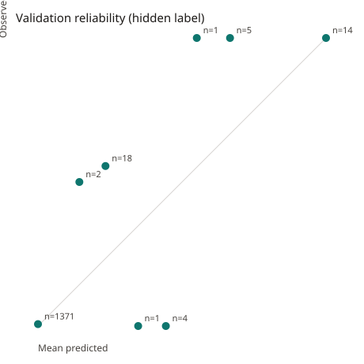

# Robustness (validation)

Generated by `python -m jachai.eval.robustness` with profile `fast`, seed 42. Synthetic data only. LightGBM threshold fit on validation targets. Validation payments: N=1,416, positives=40. The test split is not scored. Compute time for this whole command (robustness, peer trend, adversary): 11.1s.

## Per-pattern recall

Recall is flagged misuse payments in that pattern divided by misuse payments in that pattern. Look-alike pattern rows are honest by construction; their recall column is the flag rate.

| Pattern | Kind | N | Positives | Flagged | Recall | FPR |
|---|---|---|---|---|---|---|
| round_amount_cash_desk | misuse | 14 | 14 | 9 | 0.643 | n/a |
| remittance_drain | misuse | 0 | 0 | 0 | n/a | n/a |
| limit_bypass | misuse | 26 | 26 | 10 | 0.385 | n/a |
| incentive_splitting | misuse | 0 | 0 | 0 | n/a | n/a |
| p2p_disguise | misuse | 0 | 0 | 0 | n/a | n/a |
| turnover_burst | misuse | 0 | 0 | 0 | n/a | n/a |
| hn_big_ticket_retail | look_alike_pattern | 4 | 0 | 0 | n/a | 0.000 |
| hn_grocery_bulk_buy | look_alike_pattern | 4 | 0 | 0 | n/a | 0.000 |
| hn_haat_day_spike | look_alike_pattern | 49 | 0 | 0 | n/a | 0.000 |
| hn_new_shop_ramp | look_alike_pattern | 22 | 0 | 0 | n/a | 0.000 |
| hn_pharmacy_big_bill | look_alike_pattern | 2 | 0 | 0 | n/a | 0.000 |
| hn_phone_purchase | look_alike_pattern | 2 | 0 | 0 | n/a | 0.000 |

## Look-alike false-positive rate

| Slice | Honest payments | Flagged honest | FPR |
|---|---|---|---|
| wholesalers | 15 | 0 | 0.000 |
| electronics | 21 | 0 | 0.000 |
| festival spikes | 0 | 0 | n/a |
| new shops | 22 | 0 | 0.000 |

Festival pattern `hn_festival_spike` is configured for 2026-10-16 to 2026-10-21. This profile's calendar ends 2026-10-15. If the festival starts after the calendar, a zero count is the calendar, not a missing check.

## Before and after 1 Oct

The fast validation window starts after 1 Oct, so it has no before slice. The before/after contrast is train shops in the train window, which the model has already seen. Validation is reported beside it as the holdout, and it is entirely after the change. This is not a clean test of the regime shift.

| Slice | N | Positives | Mean score | Recall | Precision | FPR |
|---|---|---|---|---|---|---|
| train shops, before 1 Oct | 12,373 | 188 | 0.014 | 0.527 | 0.900 | 0.001 |
| train shops, on or after 1 Oct | 6,827 | 156 | 0.015 | 0.359 | 0.933 | 0.001 |
| validation shops (all after 1 Oct in this profile) | 1,416 | 40 | 0.017 | 0.475 | 1.000 | 0.000 |

## Calibration

Reliability of the calibrated payment score against the hidden label, validation payments. The calibrator itself was fit to validation targets, not to this label, so a gap is expected.

| Bin | N | Mean predicted | Observed misuse rate |
|---|---|---|---|
| 0.0–0.1 | 1,371 | 0.000 | 0.007 |
| 0.1–0.2 | 2 | 0.144 | 0.500 |
| 0.2–0.3 | 18 | 0.234 | 0.556 |
| 0.3–0.4 | 1 | 0.348 | 0.000 |
| 0.4–0.5 | 4 | 0.444 | 0.000 |
| 0.5–0.6 | 1 | 0.551 | 1.000 |
| 0.6–0.7 | 5 | 0.667 | 1.000 |
| 0.7–0.8 | 0 | n/a | n/a |
| 0.8–0.9 | 0 | n/a | n/a |
| 0.9–1.0 | 14 | 1.000 | 1.000 |

## SHAP agreement

Among flagged validation payments whose injected pattern has an expected reason list, the share whose top 3 reason codes include at least one expected code. The lists are a hypothesis (see JSON `mapping`).

Flagged misuse payments: 19. Top-3 overlap: 1.000. Top-1 is an expected code: 0.105.

| Pattern | Flagged | Top-3 overlap | Share |
|---|---|---|---|
| round_amount_cash_desk | 9 | 9 | 1.000 |
| remittance_drain | 0 | 0 | n/a |
| limit_bypass | 10 | 10 | 1.000 |
| incentive_splitting | 0 | 0 | n/a |
| p2p_disguise | 0 | 0 | n/a |
| turnover_burst | 0 | 0 | n/a |

## Network score on honest clusters

Denominator: honest non-test shops that share at least one payer with another honest shop in the same zone, using payments before the snapshot. Numerator: those shops whose existing ring_flag is 1.

Snapshot 2026-10-07. Honest shops sharing a payer in the same zone: 219. Of those, ring_flag is on for 2 (rate 0.009). Eligible misuse shops with ring_flag: rate 0.438 (N=16).

## LLM validator

These are constructed notes, not a sample of production LLM output. The API only validates optional LLM rewording; the template is the fallback.
 Live call: False. Fixtures rejected: 6 of 7.

| Fixture | Accepted | Errors |
|---|---|---|
| template_against_llm_evidence | no | numbers absent from evidence: 0.4200 |
| copies_evidence_numbers | yes | — |
| empty | no | empty note |
| accusation | no | accusation term: fraud; accusation term: guilty |
| promise | no | promise: we guarantee; promise: will be cleared |
| invented_number | no | numbers absent from evidence: 0.9999 |
| number_word | no | number words absent from evidence: nine |

## Caveats

- One fast-profile seed. Pattern counts of zero are real for this calendar, not a skipped check.
- Train-period before/after numbers describe data the model was fit on.
- SHAP overlap uses a hand-written code list. A miss means the top reasons were something else, which can still be a real signal.
- The validator rates are fixtures. They are not how often a hosted model is rejected in production.
